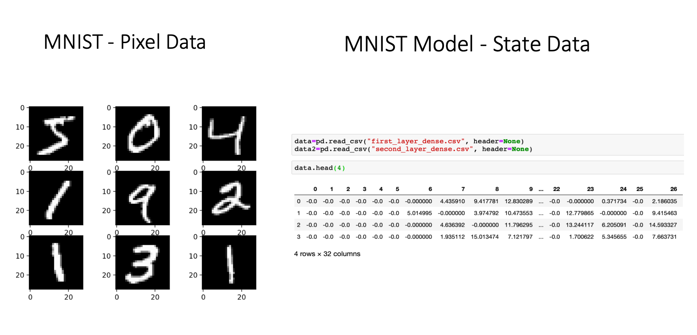
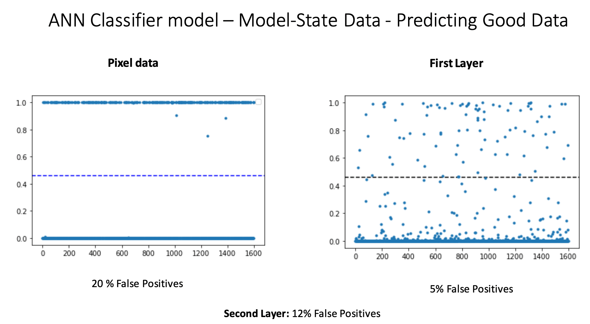

# Anomaly detection Project
This projected was performed during my machine learning internship at Irdeto (The Netherlands, 2022). I created a new method to detect anomaly samples using Isolation Forest and ANN. 

## Goal

The goal is to test and compare 2 different methods of detecting anomalies. The methods only differ in the input data that is given to the models! In this project, two different models were tested: a simple ANN (supervised) and the Isolation Forest model (unsupervised). 

**The data**

As mentioned, the two methods differ in the input data:

- The usual method: using image (pixel) data (MNIST images) as input data. I will refer to this data here as “normal data”.
- New method: using the model state of the MNIST 10-digit classifier model as data. What does this mean ? I first trained a ANN with MNIST pixel data both with normal and noisy data (the anomalies). Then, I access the state of the neurons of this ANN on the first and second layer of the model. I use this data,  the state of the neurons of both layers, as the input of Isolation Forest and another ANN. We named this data “model-state data”.

The goal here is to see which kind of anomalies each method can detect, if one method can detect certain kind of anomalies that the other is not able to detect. Besides, regarding the second method, the goal is also to study which layer data is the best to predict anomalies.

## Input data

- For the first method, pixel data (MNIST images).
- For the second method, I use the model state of the MNIST 10-digit classifier model as data for an anomaly detection model. We get the state of the neurons of a specific layer as a CSV file. 

## Methods

### The first method - ANN
The first method is to pass the model state data as input. This model state data was firstly obtained by passing mnist inbound and outbound data into a ANN and then by doing: (intermediate_layer_model = Model(inputs=model.input, outputs=model.get_layer('dense').output) 

### The second method - Isolation Forest
The second method regarding the isolation forest that I performed is simply generating outbound and inbound mnist data and passing it as an input (model = IsolationForest(max_samples=10, contamination = 0.005)) and checking the accuracy of the model.

### Types of noisy samples 

There are 4 different kind of noisy samples. We can see that from the first to fourth kind of noise, the noise rate increases.

## Results and Conclusions

### ANN Classifier

It is clear that the second method can detect better the 2nd and 3rd type of noisy samples, alhough not predicting well for the 1st and 4th type. The pixel-data method performs very poorly on detecting 2nd and 3rd type of noisy samples.

Also interesting to note is the statistical distribution of the samples in this plot. In pixel data, the predictions are more scattered, and in the model-state data is almost the complete opposite situation.

Here it is clear that the model-state method performs much better on detecting True Negatives!

So what is the conclusion? It is clear that the model-state from the first layer is able to detect very well certain kinds of noisy samples (type 2 and 3). This means that would be useful to combine both methods to detect better certain kind of noisy samples. By combining it, we would have a superior model compared to the original that only makes use of pixel data. 

### Isolation Forest

Probably the most interesting model to test this method in an unsupervised one. Can an unsupervised model detect anomalies using as input only the state of the neurons? Let's see:

#### Pixel data
- Predicting normal samples

False Positives around 50%. Not a useful model at all to predict True Negatives.
- Predicting noisy samples

Pretty weak method too to predict true outliers. 

#### Model-state data
- Predicting normal samples

The first layer predicts 100% of false positives! Not a useful model. On the other hand, the second layer performs very well, having only 1% of false positives. 

- Predicting noisy samples
The results from the first layer and second layer are shown in separated images:

- The first layer predicts well all the noisy samples. But it also yielded 100% of false positives. At the end, it is not a good approach.

- The second layer yields interesting results. With 100% of True Positives for the second, third and fourth type of noisy types, it sounds promising on detecting certain kinds of anomalous data. The only downsidde is predicting 81% of False Negative for the 1st type of noisy samples. But remember, these are the hardest outliers to detect, given that the noise ratio is the lowest.

What can we conclude for these experiments? By using model-state data on a model like Isolation Forests, we are able to detect much better these types of outbond data than using normal, pixel data. What an interesting result!

## Technologies
This project is created with:
- Python 3.9.6
- TensorFlow 2.9
- Keras 2.10
- Pandas 1.5.1
- Numpy 1.23.4
- Seaborn 0.12.1
- Matplotlib 

## Notebooks
- ANN_anomaly_detector_pixel_data.ipynb: ANN classifer model using both good and noisy pixel data
- ANN_anomaly_other_method_new.ipynb: ANN classifer model using both good and nosy model-state data.
- isolation_forest_anomaly_new: isolation forest model using model-state data. 

